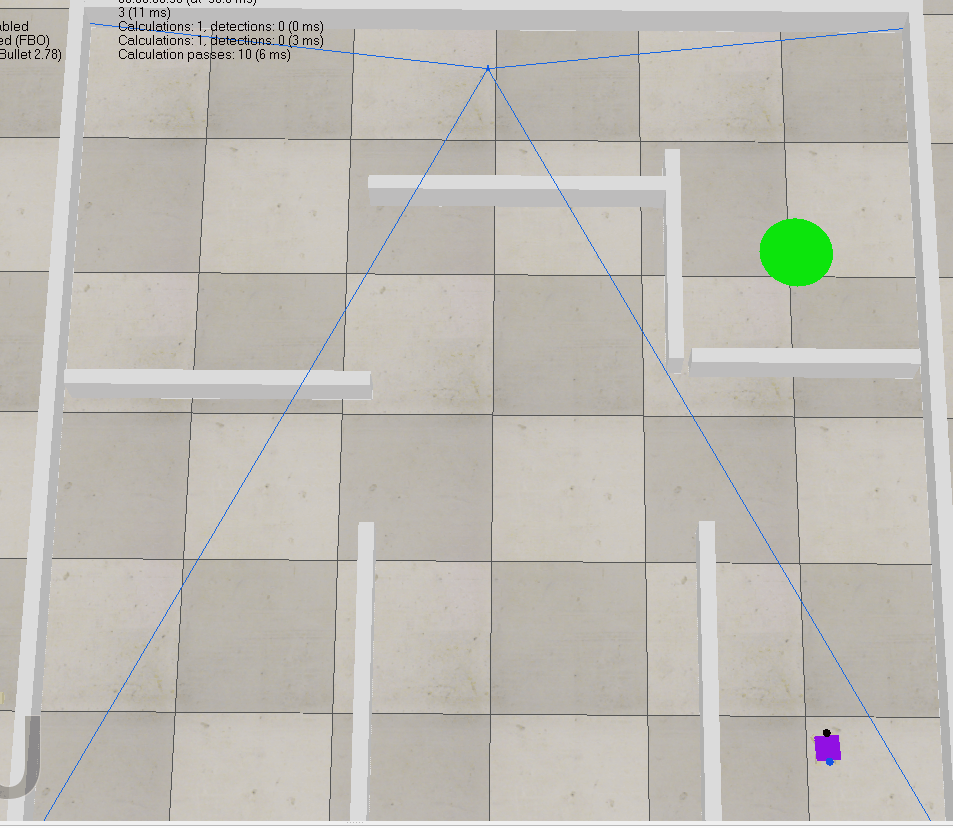

[English](README.md) | [简体中文](README_zh-CN.md)

# Mobile Robot Path Planning and Tracking Control Simulation Platform

## 1. Project Introduction

This is a simulation project based on **CoppeliaSim** and **Python**, featuring path planning algorithms (A*, RRT, RRT*), path tracking controllers (Pure Pursuit, Stanley, MPC), along with scenes and vehicle models (Differential Drive & Ackermann).


## 2. Features

*   **Robot Models**:
    *   **Differential Drive (DifferentialDrive)**: A two-wheeled differential model controlled by left and right wheel velocities.
    *   **Ackermann Steering (AckermannSteering)**: A car-like steering model controlled by the front wheel steering angle and rear wheel drive speed.

*   **Path Planning Algorithms**:
    *   **A\* (AStar)**: A classic heuristic search algorithm that guarantees the optimal path.
    *   **RRT (Rapidly-exploring Random Tree)**: A sampling-based algorithm for quick exploration in high-dimensional spaces.
    *   **RRT\* (RRT-Star)**: An optimized version of RRT that asymptotically converges to the optimal path.

*   **Path Tracking Control Algorithms**:
    *   **Lateral Controllers (Angular)**:
        *   **Pure Pursuit**: A classic geometry-based tracking algorithm.
        *   **Stanley**: A controller developed by Stanford University that considers both heading and lateral errors.
        *   **MPC (Model Predictive Control)**: An advanced optimization-based control method capable of handling multiple constraints.
    *   **Longitudinal Controller (Speed)**:
        *   **PI Controller**: A classic Proportional-Integral speed controller.
        *   **MPC**: Optionally, the MPC controller can also manage speed.

*   **Automated Reporting System**:
    *   Automatically runs experiments with different algorithm combinations and records data.
    *   Generates a 4-panel summary plot including **trajectory comparison, velocity/angular velocity curves, and tracking error curves**.
    *   Calculates and outputs Key Performance Indicators (KPIs) such as path length, planning time, tracking duration, average/max tracking error, etc.

## 3. Demonstration





## 4. Requirements

*   **Simulation Software**: CoppeliaSim Edu (V-REP)
*   **Python**: 3.7+
*   **Dependencies**: Please see `requirements.txt` for details.

## 5. How to Run
1.  **Clone the repository**: 
    ```bash
    git clone https://github.com/pangy9/Path-Planning-and-Control-for-CoppeliaSim.git
    ```
2.  **Install dependencies**:
    ```bash
    cd Path-Planning-and-Control-for-CoppeliaSim
    pip install -r requirements.txt
    ```
3.  **Run a single experiment**: Execute `main.py` with specified arguments. For example:
    ```bash
    # Run Ackermann model with A* planner and Stanley controller
    python main.py --vehicle_model AckermannSteering --planner AStar --angular Stanley --speed PI
    ```
4.  **Check the results**: After the experiment, a timestamped folder will be created in the `./report/` directory, containing a `.txt` report and a `.png` performance plot.

## 6. Project Structure

```
code/
│
├── main.py                   # Main entry point, handles simulation and module coordination
├── robot.py                  # Robot class, encapsulates interaction with the simulator
├── vehicle_model.py          # Defines kinematic models for Differential and Ackermann vehicles
├── reporter.py               # Core reporting module for data logging, calculation, and visualization
├── test.sh                   # Automation script for batch-running experiments
├── planner.py                # Implementations of A*, RRT, and RRT*
│
├── trackers/                 # Path tracking controllers module
│   ├── tracker_base.py       # PathTracker base class for combining controllers
│   ├── angular.py            # Pure Pursuit and Stanley lateral controllers
│   ├── speed.py              # PI longitudinal speed controller
│   └── mpc.py                # MPC controller
│
├── report/                   # Stores generated reports (.txt) and plots (.png)
│
└── sim.py, simConst.py, remoteApi.dll  # CoppeliaSim Remote API files (for Windows)
```