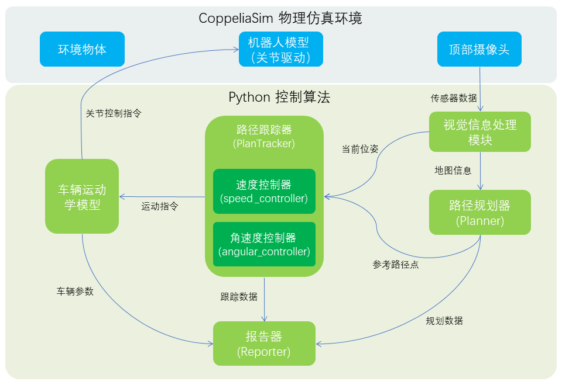
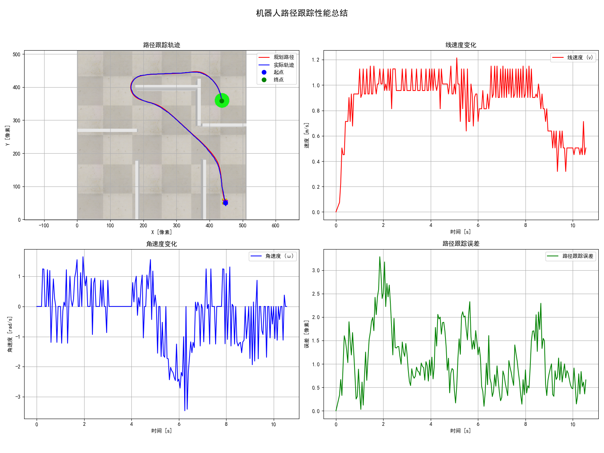
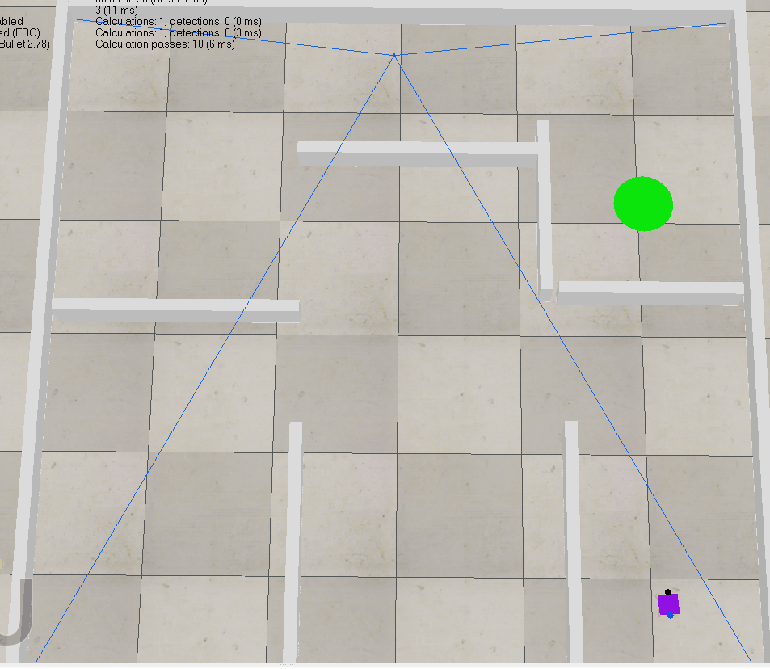
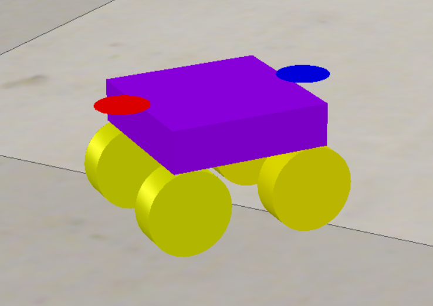
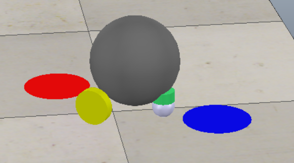

# 智能机器人路径规划与跟踪控制仿真平台

## 1. 项目简介

本项目是一个基于 **CoppeliaSim** 和 **Python** 的仿真项目，路径规划有A*、RTT、RTT*，路径跟踪有Pure Pursuit、Stanley、MPC，附有场景和差速与阿克曼小车模型文件。



## 2. 功能特性

*   **机器人模型**:
    *   **差速驱动 (DifferentialDrive)**: 两轮差速模型，通过控制左右轮速实现运动。
    *   **阿克曼转向 (AckermannSteering)**: 汽车式转向模型，通过控制前轮转向角和后轮驱动速度实现运动。

*   **路径规划算法**:
    *   **A\* (AStar)**: 经典的启发式搜索算法，保证最优路径。
    *   **RRT (Rapidly-exploring Random Tree)**: 基于随机采样的快速搜索算法，适用于高维空间。
    *   **RRT\* (RRT-Star)**: RRT的优化版本，能够渐进地收敛到最优路径。

*   **路径跟踪控制算法**:
    *   **横向控制器 (Angular)**:
        *   **Pure Pursuit (纯跟踪)**: 基于几何学的经典跟踪算法。
        *   **Stanley**: 斯坦福大学提出的经典控制器，综合考虑横向误差和航向误差。
        *   **MPC (模型预测控制)**: 基于优化理论的先进控制方法，能够同时处理多重约束。
    *   **纵向控制器 (Speed)**:
        *   **PI 控制器**: 经典的比例-积分速度控制器。
        *   **MPC**: 可选地，MPC控制器也可以同时控制速度。

*   **自动化报告系统**:
    *   自动运行不同算法组合并记录实验数据。
    *   生成包含**轨迹对比图、速度/角速度曲线、跟踪误差曲线**的四宫格性能总结图。
    *   计算并输出关键性能指标（KPIs），如：路径长度、规划耗时、跟踪时长、平均/最大跟踪误差等。

## 3. 成果展示








## 4. 环境要求

*   **仿真软件**: CoppeliaSim Edu (V-REP)
*   **Python**: 3.7+
*   **依赖库**: 详细依赖请见 `requirements.txt` 文件。


## 5. 如何运行
1.  **克隆仓库**: 
    ```bash
    git clone https://github.com/pangy9/Path-Planning-and-Control-for-CoppeliaSim.git
    ```
2.  **安装依赖**:
    ```bash
    cd Path-Planning-and-Control-for-CoppeliaSim
    pip install -r requirements.txt
    ```
3.  **启动仿真**: 打开CoppeliaSim软件，并加载你的场景文件 (例如 `scene.ttt`)。
4.  **运行单个实验**: 执行`main.py`并指定参数。例如：
    ```bash
    # 运行阿克曼模型, A*规划器, Stanley控制器
    python main.py --vehicle_model AckermannSteering --planner AStar --angular Stanley --speed PI
    ```
5.  **查看结果**: 实验结束后，在`./report/`目录下会生成带时间戳的文件夹，其中包含`.txt`报告和`.png`性能图。

## 6. 项目文件结构

```
code/
│
├── main.py                   # 主程序入口，负责启动仿真和协调各模块
├── robot.py                  # Robot类，封装了机器人与仿真器的交互逻辑
├── vehicle_model.py          # 定义了差速和阿克曼两种车辆的运动学模型
├── reporter.py               # 核心报告模块，用于数据记录、计算和可视化
├── test.sh                   # 自动化测试脚本，用于批量运行不同算法组合
├── planner.py                # A*、RRT、RRT*算法实现
│
├── trackers/                 # 路径跟踪器模块
│   ├── tracker_base.py       # PathTracker基类，用于组合横向和纵向控制器
│   ├── angular.py            # Pure Pursuit 和 Stanley 横向控制器
│   ├── speed.py              # PI 纵向速度控制器
│   └── mpc.py                # MPC 控制器
│
├── report/                   # 存放生成的报告文件(.txt)和性能图(.png)
│
└── sim.py, simConst.py, remoteApi.dll  # CoppeliaSim 远程API相关文件(Windows平台)
```